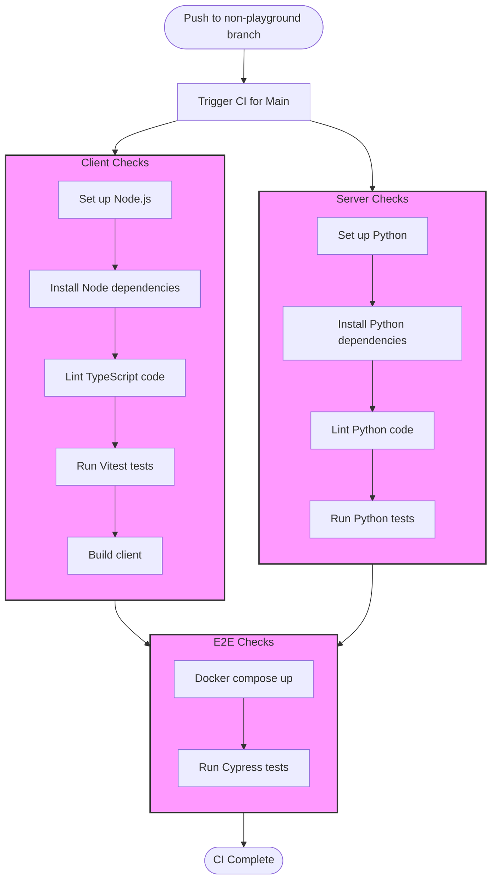

# Workflows readme
There are 4 workflows: main, release, playground and local.

- `main.yml` is the main CI workflow ran for all branches except playground, split into jobs client-checks (Vitest and Eslint), server-checks (Pytest and Pylint) and e2e-checks (regular build and Cypress) that only runs if the first two pass
- `release.yml` is the Rahti-aimed CD workflow that is activated by new releases, and it builds and pushes via secret tokens an image of the main branch to Docker Hub's `ohtukontitus/news-collection:latest` (watched by imagestream at Rahti every 15 mins), plus it looks at the release tag to set it as an env in the image and also sets the not-really-a-secret mail address also as an env (Rahti doesn't need authentication tokens for university emails)
- `playground.yml` is for the playground branch which as name implies is for playing around and testing things that can't be tested locally in development
- `local.yml` is a customized workflow for local runs

IMPORTANT: set GitHub Actions secrets DOCKERHUB_USERNAME as your Dockerhub username, DOCKERHUB_TOKEN as your Dockerhub access token and SMTP_SENDER as the first part of your csc.fi email address (as in everything before @csc.fi), which is also at current time shared with the helsinki.fi address of the same name that is used for the email's reply-to address. The email address is in a secret for easy adjustability without having to touch the code, a bit of extra security and also to reduce the spam email it receives.

