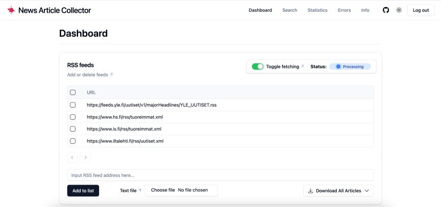
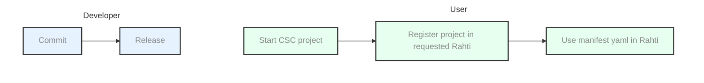
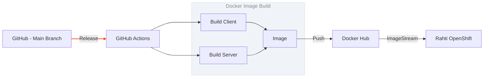
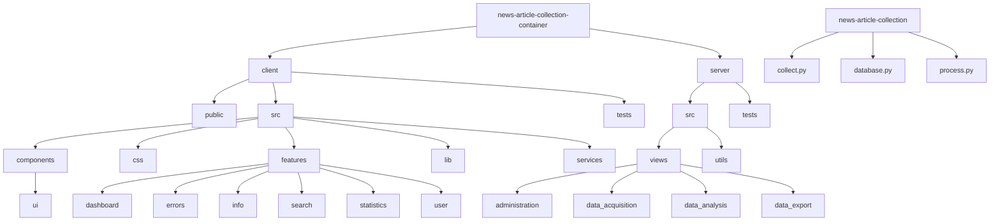

# News Article Collection Container

## Legal disclamer

Thank you for choosing our software!
We are happy to have you here, and strive to provide you the best experience.
Please keep in mind that it is your responsibility to make sure you use the software only for legal and permitted purposes - we cannot guarantee that the product is suitable for any specific purpose or need you might have.

# OHTU

[](https://github.com/uh-dcm/news-article-collection-container/actions/workflows/main.yml) [](https://github.com/uh-dcm/news-article-collection-container/actions/workflows/release.yml) [](https://www.helsinki.fi/en/center-information-technology/about-it-center/open-source-code-principles) [](https://my.csc.fi/) [](https://rahti.csc.fi/)

This is a repository for further development of the news article collection tool based in repository [news-article-collection](https://github.com/uh-dcm/news-article-collection), originally developed by [matnel](https://github.com/matnel). This project extends the tool by containerizing it with Docker and optimizing it for deployment on the [CSC](https://my.csc.fi/) [Rahti 2](https://rahti.csc.fi/) OpenShift service. It offers a web application built with TypeScript, React and Tailwind CSS, aided by Vite. The backend utilizes Python with Flask, JWT and APScheduler, with the SQLite database being sourced from the original tool. Testing is done via Vitest for frontend tests, Pytest for backend and Cypress for end-to-end tests.

This was worked on as part of the University of Helsinki [Ohjelmistotuotantoprojekti TKT20007](https://github.com/HY-TKTL/TKT20007-Ohjelmistotuotantoprojekti) course for the summer of 2024.

Front page screenshot:
<p align="center">
  
</p>

Short action charts for developer and user (see more in [rahti-guide.md](./docs/rahti-guide.md)):


Chart of the CD triggered by a release:


Graph of the directories of the main functionalities:


## Development documentation

- [Definition of Done & Practices](./docs/dod-practices.md)
- [Product Backlog](https://github.com/orgs/uh-dcm/projects/3/views/1)
- Summer 2024 task boards: [Sprint 1](https://github.com/orgs/uh-dcm/projects/6/views/1), [Sprint 2](https://github.com/orgs/uh-dcm/projects/9/views/1), [Sprint 3](https://github.com/orgs/uh-dcm/projects/10/views/1), [Sprint 4](https://github.com/orgs/uh-dcm/projects/11/views/1), [Sprint 5](https://github.com/orgs/uh-dcm/projects/13/views/1), [Sprint 6](https://github.com/orgs/uh-dcm/projects/17/views/1)
- [Future development](./docs/future-development.md)

## Starting the app locally

Make sure you have Docker installed!

From the root folder of the project, build and start the container:

```
docker compose up --build
```

After this, you can access the website at [http://localhost:4000/](http://localhost:4000/).

### Stopping the container

Press CTRL+C in the terminal for graceful shutdown.

Then either of the following:
1. `docker compose stop` for stopping the container without removing it, after which it can be started again with `docker compose start`
2. `docker compose down` for stopping and removing the container and its Docker network, and with flag `--rmi all` if you want to remove the image as well.

## Setting up dev environment

Starting from the root of the project:

```bash
docker compose -f docker-compose.dev.yml up --build
```

Now the whole project environment should be running, with real-time changes rendered. Also reachable from http://localhost:4000/.
