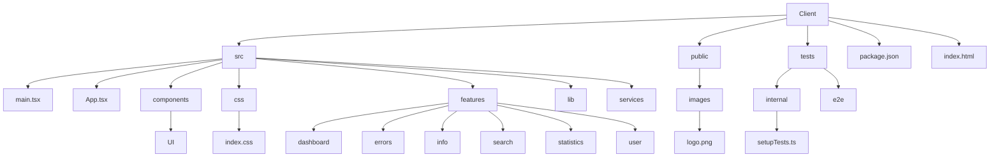

# Client or frontend structure



The client uses React on TypeScript, utilizing Tailwind CSS, and with Vite supporting development. Tests are Vitest and linting is done with ESLint and Prettier.

The main frontend application is in the `src` folder, with its starting point being in the index.html in this folder. The `public` folder contains static assets, such as the logo.png in /images. The package.json is the dependency configuration file for the npm package manager. The Dockerfile in this folder is just used for development, to run the client separately. The `tests` folder has, as it says, tests.

Client is first ran through index.html, which then runs main.tsx in src, which then in its turn runs App.tsx, also utilizing config.tsx and vite-env.d.ts. The main.tsx has some very general tsx configurations for the whole client, while App.tsx delves into more specific route listing and workings. The folders in src are components, css, features, lib and services. The `components` folder has some general components that are the backbone of the web app, such as UI. The `css` folder has just index.css and TailwindCSS related settings. We also have `services`, which has general utility type functions shared by many modules. The `lib` folder has miscellaneous bits. Then we have `features`, which is where the pages and their specific functions are located at. It's split into dashboard, errors, info, search, statistics and user folders, which all except for user represent their page names. The user folder has register, login and reregister validation modules, as in user control related pages. All files in these folders except for the main page ones are generally only used by others in the same folder, thus not widely shared.

Note that stop-words.tsx is quite useful for finetuning words you want to limit out of the word cloud: simply add ones you don't want to see to the list.

Client tests are located in the `internal` folder in the tests folder. They are configured by vite.config.ts, tsconfig.json and also the scripts section in package.json. The setupTests.ts in the internal folder is their more specific configuration file. Testing also generates a .gitignored coverage folder in the tests folder. And for Cypress, the file cypress.config.ts here is their config file, and `e2e` folder in tests is where the test files like news_article_collector.cy.ts and .gitignored test generated artifacts such as screenshots and downloads are located.

## React + TypeScript + Vite

This template provides a minimal setup to get React working in Vite with HMR and some ESLint rules.

Currently, two official plugins are available:

- [@vitejs/plugin-react](https://github.com/vitejs/vite-plugin-react/blob/main/packages/plugin-react/README.md) uses [Babel](https://babeljs.io/) for Fast Refresh
- [@vitejs/plugin-react-swc](https://github.com/vitejs/vite-plugin-react-swc) uses [SWC](https://swc.rs/) for Fast Refresh

## Expanding the ESLint configuration

If you are developing a production application, we recommend updating the configuration to enable type aware lint rules:

- Configure the top-level `parserOptions` property like this:

```js
export default {
  // other rules...
  parserOptions: {
    ecmaVersion: 'latest',
    sourceType: 'module',
    project: ['./tsconfig.json', './tsconfig.node.json'],
    tsconfigRootDir: __dirname,
  },
}
```

- Replace `plugin:@typescript-eslint/recommended` to `plugin:@typescript-eslint/recommended-type-checked` or `plugin:@typescript-eslint/strict-type-checked`
- Optionally add `plugin:@typescript-eslint/stylistic-type-checked`
- Install [eslint-plugin-react](https://github.com/jsx-eslint/eslint-plugin-react) and add `plugin:react/recommended` & `plugin:react/jsx-runtime` to the `extends` list
