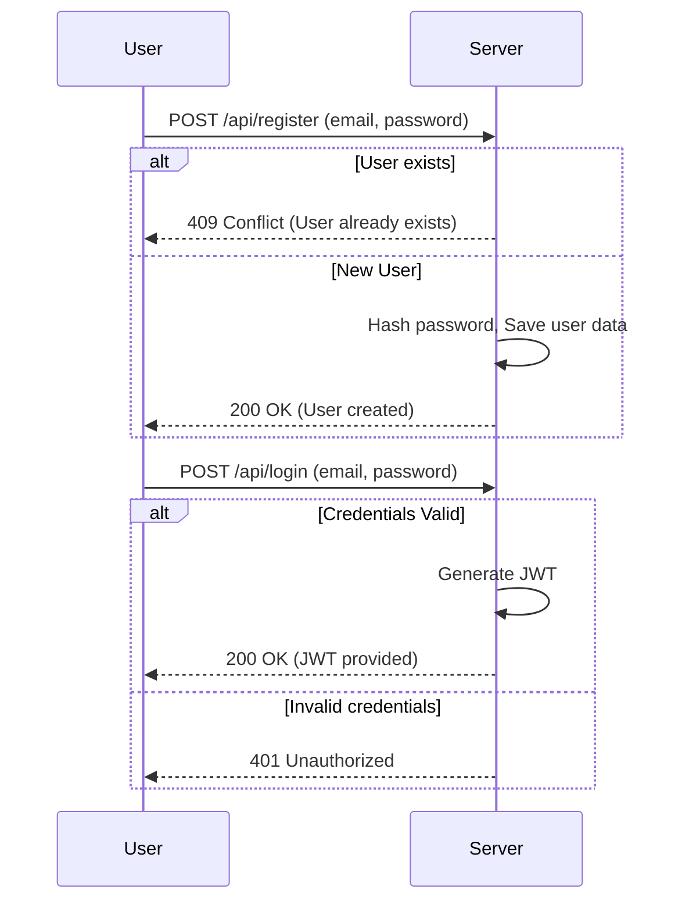

# Authentication Overview

This application uses a token-based authentication mechanism to handle user login and registration. We utilize JSON Web Tokens (JWT) to implement secure and efficient user sessions.

## Registration

A user (max 1) can register through the `/api/register` endpoint. The password provided by the user is hashed using Werkzeug's `generate_password_hash`, which is a high quality Python library.

## Re-registration

Reregistration can only happen through by clicking "forgot password?", and opening the password reset link that comes to the user's email.

### Process:

1. The user provides an email and password.
2. The system checks if the user already exists (non re-registration).
3. If the user exists and is not re-registering, a conflict message is returned.
4. If new or re-registering, the user's hashed password and email are saved.

## Login

A registered user can log in through the `/api/login` endpoint. The process verifies the email and password, creates a JWT if authentication succeeds, and returns it to the user,
which the frontend stores in `localStorage` (a token is valid for 60 minutes).

### Process:

1. The user submits only their password.
2. If the password is incorrect, an error is returned.
3. If successful, a JWT is created and returned, which the user uses to access all parts of the program. Without JWT, the user can access nothing else than authentication features.

## Configuration

The backend uses configurations for settings like JWT secret key, re-registration secret key and token expiration settings. Here are the key aspects:

- **JWT Secret Key**: Unique secret key used to sign JWTs.
- **Re-register Secret Key** Unique secret key used to sign and verify a re-registration link.
- **Token Expiration**: JWTs expire 60 minutes after being issued.

## Mermaid Diagram: Authentication Flow

## Troubleshooting

Common issues during authentication include:

- **Expired JWT**: Users are prompted to log in again if their token has expired.
- **Application Restart**: The JWT Secret Key is new each time the server restarts, which is used to sign and verify JWT tokens, so any previous valid tokens will be invalidated.
