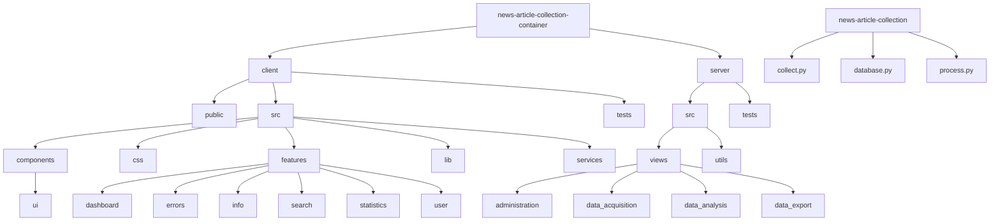

General project structure in Markdown.

1. Mermaid graph of the directories of the main functionalities



2. Project structure in ASCII tree style

```
└── 📁news-article-collection-container
    └── Dockerfile
    └── 📁.github
        └── 📁workflows
    └── 📁client
        └── package.json
        └── 📁public
            └── 📁images
        └── 📁src
            └── App.tsx
            └── main.tsx
            └── 📁components
                └── 📁ui
            └── 📁css
            └── 📁features
                └── 📁dashboard
                └── 📁errors
                └── 📁info
                └── 📁search
                └── 📁statistics
                └── 📁user
            └── 📁lib
            └── 📁services
        └── 📁tests
            └── 📁e2e
            └── 📁internal
    └── 📁docs
        └── 📁assets
    └── 📁manifests
        └── 📁manifests_components
        └── 📁manifests_playground
    └── 📁server
        └── requirements.txt
        └── requirements-dev.txt
        └── 📁src
            └── app.py
            └── 📁views
                └── 📁administration
                └── 📁data_acquisition
                └── 📁data_analysis
                └── 📁data_export
            └── 📁utils
        └── 📁tests
            └── 📁test_views
```

```
└── 📁news-article-collection
    └── collect.py
    └── database.py
    └── process.py
    └── requirements.txt
```

<!-- The whole directory PLUS files was too much work for little benefit. -->
