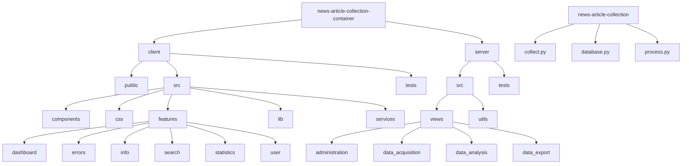

General project structure in Markdown. Date: August 14, 2024. Intermittently updated.

1. Mermaid graph of the directories of the main functionalities



2. Whole directory structure in ASCII tree style

```
└── 📁news-article-collection-container
    └── 📁.github
        └── 📁workflows
    └── 📁client
        └── 📁public
            └── 📁images
        └── 📁src
            └── 📁components
                └── 📁ui
            └── 📁css
            └── 📁features
                └── 📁dashboard
                └── 📁errors
                └── 📁info
                └── 📁search
                └── 📁statistics
                └── 📁user
            └── 📁lib
            └── 📁services
        └── 📁tests
            └── 📁e2e
            └── 📁internal
    └── 📁docs
        └── 📁assets
    └── 📁manifests
        └── 📁manifests_playground
    └── 📁server
        └── 📁src
            └── 📁views
                └── 📁administration
                └── 📁data_acquisition
                └── 📁data_analysis
                └── 📁data_export
            └── 📁utils
        └── 📁tests
            └── 📁test_views
```

```
└── 📁news-article-collection
```

3. Whole structure including files in ASCII tree style

```
└── 📁news-article-collection-container
    └── 📁.github
        └── 📁workflows
            └── local.yml
            └── main.yml
            └── playground.yml
            └── release.yaml
        └── README-WORKFLOW.md
    └── 📁client
        └── 📁public
            └── 📁images
                └── logo.png
        └── 📁src
            └── 📁components
                └── 📁ui
                    └── accordion.tsx
                    └── article-columns.tsx
                    └── button.tsx
                    └── card.tsx
                    └── checkbox.tsx
                    └── data-table.tsx
                    └── download-button.tsx
                    └── drawer.tsx
                    └── dropdown-menu.tsx
                    └── feed-columns.tsx
                    └── form.tsx
                    └── highlighted-text.tsx
                    └── info-icon.tsx
                    └── input.tsx
                    └── label.tsx
                    └── mode-toggle.tsx
                    └── scroll-area.tsx
                    └── separator.tsx
                    └── skeleton.tsx
                    └── sonner.tsx
                    └── switch.tsx
                    └── table.tsx
                    └── textarea.tsx
                    └── theme-provider.tsx
                    └── toast.tsx
                    └── toaster.tsx
                    └── use-toast.ts
                └── animation-variants.ts
                └── Footer.tsx
                └── Header.tsx
                └── page-layout.tsx
            └── 📁css
                └── index.css
            └── 📁features
                └── 📁dashboard
                    └── Dashboard.tsx
                    └── feed-urls.tsx
                    └── fetching-news.tsx
                    └── rss-input.tsx
                └── 📁errors
                    └── Errors.tsx
                    └── log-records.tsx
                └── 📁info
                    └── Info.tsx
                    └── info-accordion.tsx
                └── 📁search
                    └── Search.tsx
                └── 📁statistics
                    └── piechart.tsx
                    └── statistics-drawers.tsx
                    └── Statistics.tsx
                    └── timeseries.tsx
                └── 📁user
                    └── Login.tsx
                    └── Register.tsx
                    └── reregister-button.tsx
                    └── ReregisterValidator.tsx
            └── 📁lib
                └── svg-paths.ts
                └── utils.ts
            └── 📁services
                └── article-download.tsx
                └── authclient.tsx
                └── authfunctions.tsx
                └── database-queries.tsx
            └── App.tsx
            └── config.tsx
            └── main.tsx
            └── vite-env.d.ts
        └── 📁tests
            └── 📁e2e
                └── news_article_collector.cy.ts
            └── 📁internal
                └── App.test.tsx
                └── button.test.tsx
                └── card.test.tsx
                └── data-table.test.tsx
                └── Footer.test.tsx
                └── Header.test.tsx
                └── input.test.tsx
                └── label.test.tsx
                └── QuestionsAccordion.test.tsx
                └── rss-input.test.tsx
                └── setupTests.ts
                └── sonner.test.tsx
        └── .eslintrc.cjs
        └── .eslintrc.json
        └── .prettierrc
        └── Dockerfile
        └── components.json
        └── cypress.config.ts
        └── index.html
        └── package-lock.json
        └── package.json
        └── postcss.config.js
        └── README.md
        └── tailwind.config.ts
        └── tsconfig.json
        └── tsconfig.node.json
        └── vite.config.ts
    └── 📁docs
        └── 📁assets
            └── rahti
        └── dod-practices.md
        └── rahti.md
        └── testing-instructions.md
        └── project-structure.md
    └── 📁manifests
        └── 📁manifests_playground
            └── deployment.yaml
            └── imagestream.yaml
            └── route.yaml
        └── build-prod.yaml
        └── deployment-prod.yaml
        └── image-stream.yaml
        └── pvc-prod.yaml
        └── README.md
        └── service-route-prod.yaml
    └── 📁server
        └── 📁src
            └── 📁views
                └── 📁administration
                    └── log_operations.py
                    └── mail_dispatcher.py
                    └── reregistration.py
                    └── status_stream.py
                    └── user_management.py
                └── 📁data_acquisition
                    └── content_fetcher.py
                    └── feed_manager.py
                └── 📁data_analysis
                    └── query_processor.py
                    └── stats_analyzer.py
                └── 📁data_export
                    └── export_manager.py
                    └── format_converter.py
            └── 📁utils
                └── auth_utils.py
                └── log_config.py
                └── processing_status.py
                └── resource_management.py
            └── app.py
            └── config.py
            └── routes.py
        └── 📁tests
            └── 📁test_views
                └── test_content_fetcher.py
                └── test_export_manager.py
                └── test_feed_manager.py
                └── test_format_converter.py
                └── test_log_operations.py
                └── test_mail_dispatcher.py
                └── test_query_processor.py
                └── test_stats_analyzer.py
                └── test_user_management.py
            └── conftest.py
            └── database_filler.py
            └── test_auth_utils.py
            └── test_index.py
        └── Dockerfile
        └── Dockerfile.dev
        └── pytest.ini
        └── README.md
        └── requirements.txt
        └── requirements-dev.txt
    └── .pylintrc
    └── docker-compose.dev.yml
    └── docker-compose.yml
    └── Dockerfile
    └── LICENSE
    └── quicktest.sh
    └── README.md
    └── runtests.sh
```

```
└── 📁news-article-collection
    └── collect.py
    └── database.py
    └── process.py
    └── README.md
    └── requirements.txt
```
