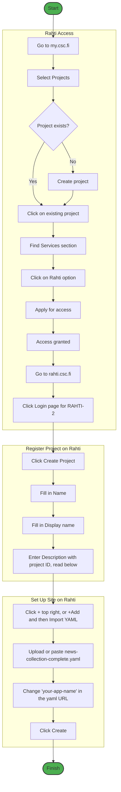
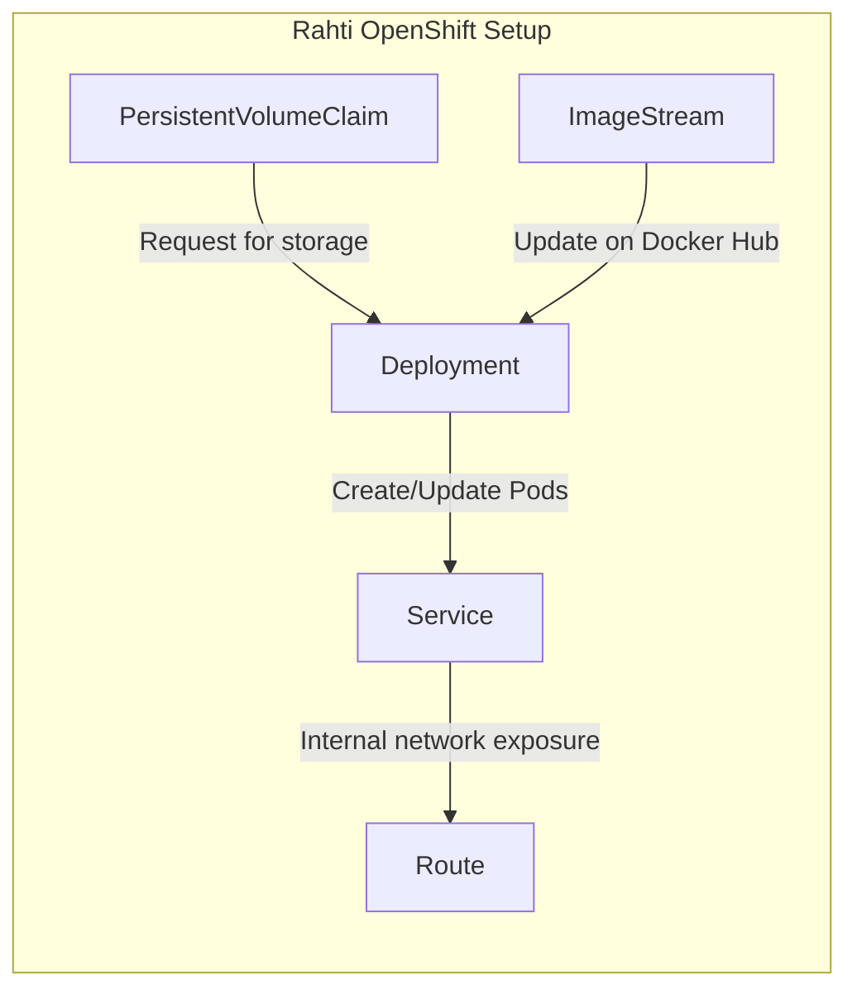

# Simple guide for setting up the app on Rahti



### Rahti access

1. Go to https://my.csc.fi/
2. Select **Projects** (currently on the left sidebar)
3. If there isn't a project yet, create one; otherwise, click on the existing project
4. On the next page, find the small **Services** section (currently on the right sidebar)
5. Click on the **Rahti** option and apply for access
6. Once access is granted, go to https://rahti.csc.fi/ and click on **Login page** for RAHTI-2

### Registering your project on Rahti (it doesn't detect your project automatically)

1. Click **Create Project**
2. In the small window that opens, there should be 3 input sections to fill in:
   - **Name**: Your custom, generally doesn't show for others
   - **Display name**: Your custom, generally doesn't show for others
   - **Description**: This is a very strict input field for the project ID and the input must be in this exact format including the csc_project:
     ```
     csc_project: 2009612
     ```
     Replace the ID with your own project ID (found as "Project number" on https://my.csc.fi/)

### Actually setting up your site on Rahti

1. Click the **+** sign (top right),  or **+Add** (left sidebar) and then in that **Import YAML**, whichever way since both open the same page
2. In the large black input field under the title **Import YAML**:
   - Drag and drop the `news-collection-complete.yaml` file, or more easily just copy all of the content from the file and paste it into the input field
3. IMPORTANT: in this view change `your-app-name` in `your-app-name.2.rahtiapp.fi` to your chosen address
4. Click **Create**

The app will start up in about a minute, after which you can visit your chosen address. In the app itself, you will be asked to register your email and password. A confirmation email will be sent to your mailbox. If it doesn't arrive, there may have been a typo in the inputted email address. You can also re-register a new email and a password even after registering, but only when having registered with a working email address.

<br><br><br>

# Technical details

## Auto-update system

There is an auto-update system (the imagestream) that checks every 15 minutes for new releases of the GitHub repo (from [Docker Hub](https://hub.docker.com/r/ohtukontitus/news-collection)). When an update happens, the pod is shut down and the updated one replaces it, taking about a minute again, but nothing happens to the data in the PVC.

## Customizing resources

If you're interested in the customizable storage, cpu and memory fields in the yaml, we recommend maxing out the storage, but being a bit modest with the cpu and memory, although very large resource hungry databases are untested, so these two values may need to be increased.

### Clearing storage

If you run out of storage space, download your data, and go through the following to delete the collected article data:

- Going to the pod details page, either: 
    - Path 1. On the front page graph view, click on the correct deployment/pod, then on the side panel that opens click the **Resources** tab, then click on the pod's link there.
    - Path 2. Click **Project** on left sidebar, and on the opened up page, click on **Pods** down left under the small **Inventory** section, then click on the right pod. Both paths arrive at the same page.
- Now on the pod details page, look at the tab options, and click **Terminal** at the right edge.
- Enter `df -h` to see how much `/app/server/rss-fetcher/data` has used of its allocation.
- Enter `rm -f /app/server/rss-fetcher/data/data.db` to remove the database.
- Enter `df -h` again to see the change has taken effect. If it hasn't, on the front page **Restart rollout** in the Actions menu as in right click menu on the deployment/pod. This doesn't clear the PVC, just resets the deployment and clears cache. Also regarding the terminal, you can navigate with the cd command and see file contents with ls -l.

After that when you fetch again, it should be automatically created anew.

### Changing CPU and memory

Changing cpu and memory afterwards isn't that difficult. In **Topology**, you can right click on the deployment/pod or in the detailed settings select Actions, and from that dropdown menu select **Edit resource limits**.

Update them to what you want and press save, although note that there is a maximum limit-to-request ratio, and with cpu it's 5. Request is almost like minimum and limit is maximum, although not exactly, as request should be somewhat over what your app usually ever needs, and limit is the absolute maximum limit it can ever get. Going over the limit in peak usage makes the pod crash momentarily.

If the Topology view isn't available, click **Project** on the left, then on the next page scroll down a bit until you see section **Inventory** on the left under which is **X Deployments** (X being a number), and click on that, and on the next page your deployment, then there click **YAML** in the tabs. There, look for the memory and cpu fields (CTRL + F may come handy). Not the ones like 'f:memory': {} but ones with values like memory: 1Gi.

### Changing Storage

Changing storage, if you for example need to accommodate guest apps and need to reduce your storage to 80Gi to fit them under the max 100Gi storage limit, is very difficult on Rahti. Making the PVC smaller isn't possible to begin with, but on top of that Rahti has limitations on what you could regularly do with OpenShift, so growing your filesystem is difficult too. There is an option for adding storage, but it can't use the same mount path. Essentially the easiest and sometimes the only way is to just download your data and redo everything from the start (going through the removal process below), but setting the storage at 80Gi in the yaml the next time.

## Troubleshooting and deployment removal

If something about the deployment fails, and you want to completely shut down all of the previous setup, in the web client you sadly have to go shut down the deployment, the service, the route, the PVC and the imagestream all one by one separately, although some smaller changes are possible just by changing values in the web client. Note that if the PVC is shut down, the data collected thus far is lost.

If needed, the way to remove all of the parts on the web client:
- **Deployment**: click **Project** on the left in **Developer** (default) mode, then under **Inventory** on the left click **Deployments**, then there the three dots to the right and **Delete Deployment**.
- **Services**: Same thing but under **Inventory** click **Services**, then the three dots and **Delete Service**.
- **Routes**: Same thing but under **Inventory** click **Routes**, then the three dots and **Delete Route**.
- **PVC**: Same thing but under **Inventory** click **PersistentVolumeClaims**, then the three dots and **Delete PersistentVolumeClaim**. Deployment that depends on this needs to be removed first.
- **ImageStream**: Usually doesn't need to be removed, but above left, click on **Developer** and select **Administrator**. In this mode, click **Builds** on the left, and **ImageStreams** under it. Then same as before, three dots and **Delete ImageStream**. Return the upper left mode to Developer afterwards.

Note that sometimes names for things may cause odd issues that don't show up anywhere, leading to a need to try different names. Also, you can compare specific Docker images by removing the `annotations:` block in the live deployment yaml and replacing `image: news-collection:latest` with `image: X/news-collection:vX.X`, replacing the 3 Xs in this with the Docker account and the version number.


